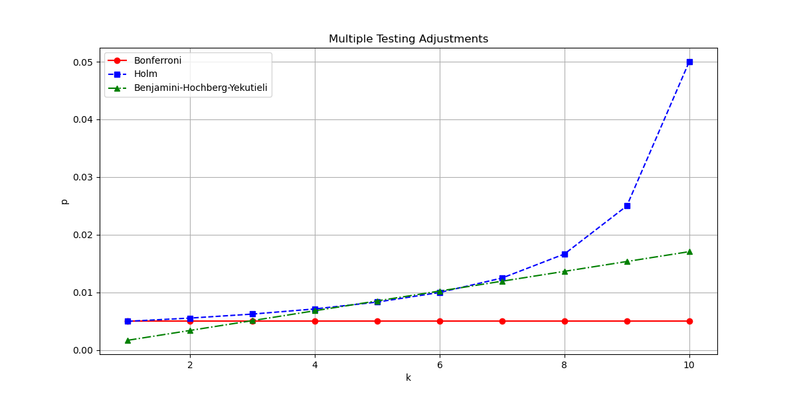

# Investment Strategy Evaluation

This repository contains functions for evaluating investment strategies considering multiple testing.

  

  <i>Adjusted significance levels for $m=10$ and $\alpha=.05$</i>

## Sharpe Ratio and $t$-Statistic

### Sharpe Ratio

The Sharpe Ratio measures the average return that exceeds the risk-free rate, relative to the volatility of the return. It is a commonly used metric to understand the risk-adjusted return of an investment.

$$
SR = \frac{\mu - r_f}{\sigma}
$$

- $\mu$: Mean return
- $r_f$: Risk-free rate
- $\sigma$: Standard deviation of the return

### $t$-Statistic

The $t$-Statistic here refers to the average excess return and is a scaled function of the Sharpe Ratio:

$$
t = \frac{\mu - r_f}{\sigma} \times \sqrt{N} = SR \times \sqrt{N}
$$

- $N$: Number of returns

## Multiple Testing Adjustments

### Bonferroni Method

The Bonferroni Method is a conservative approach for multiple testing correction. It reduces the chance of type I errors (false positives) by dividing the significance level by the number of tests.

$$
t = \Phi^{-1}\left(1 - \frac{\alpha}{2m}\right)
$$

- $\Phi$: CDF of the standard normal distribution
- $\alpha$: Significance level
- $m$: Number of tests

### Holm Method

The Holm Method is a stepwise correction that is less conservative than the Bonferroni Method. It adjusts the $p$-values sequentially, starting from the most significant one, and ensures that the type 1 error rate is maintained across multiple tests.

$$
t_{k} = \Phi^{-1}\left(1 - \frac{\alpha}{2(m + 1 - k)}\right)
$$

- $k$: Index of the test sorted by ascending $p$-value

### Benjamini-Hochberg-Yekutieli Method

The BHY Method controls the False Discovery Rate (FDR) and is less conservative than Family-wise Error Rate (FWER) methods like Bonferroni and Holm. FDR is the expected proportion of false discoveries among the rejected hypotheses.

$$
t_{k} = \Phi^{-1}\left(1 - \frac{k \times \alpha}{2m \times \left(\frac{1}{1} + \frac{1}{2} + \cdots + \frac{1}{m}\right)}\right)
$$

## Adjusting the Sharpe Ratio

The Sharpe Ratio is adjusted by plugging the adjusted  $t$-statistic into the rearranged equation to compute the $t$-statistic from the Sharpe Ratio.

$$
SR_{adj} = \frac{t_{adj}}{\sqrt{N}}
$$
