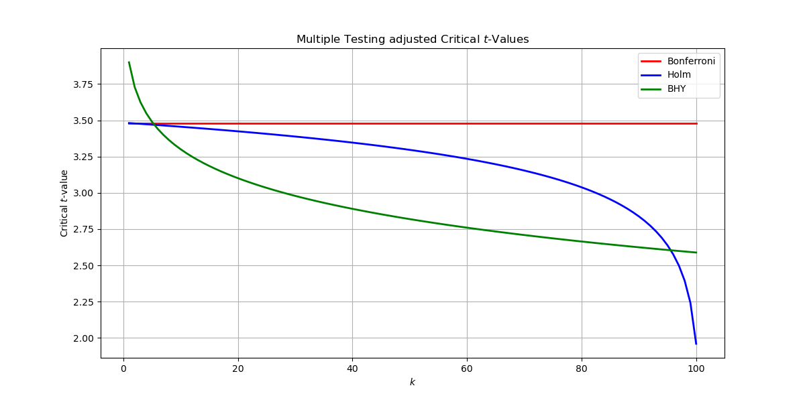

# Investment Strategy Evaluation

Testing multiple investment strategies until you find one with a high Sharpe Ratio inflates the probability of finding something that looks good by pure chance (Type I error). This repository contains functions for evaluating investment strategies considering multiple testing.

  

  <i>Adjusted critical $t$-values for $m=100$ and $\alpha=.05$</i>

## Sharpe Ratio and $t$-Statistic

### Sharpe Ratio [`sharpe_ratio`]

The Sharpe Ratio measures the average return that exceeds the risk-free rate, relative to the volatility of the return. It is a commonly used metric to understand the risk-adjusted return of an investment.

$$
SR = \frac{\mu - r_f}{\sigma}
$$

- $\mu$: Mean return
- $r_f$: Risk-free rate
- $\sigma$: Standard deviation of the return

### Expected maximum Sharpe Ratio [`expected_max_sharpe_ratio`]

When testing $M$ independent strategies, the expected Sharpe Ratio of the best strategy $SR_{max}$ can be approximated by

$$
\mathbf{E}[SR_{max}] \approx \mathbf{E}[SR_{m}] + \sqrt{\mathbf{Var}[SR_{m}]} \left( (1 - \gamma) \Phi^{-1} \left[ 1 - \frac{1}{N} \right] + \gamma \Phi^{-1} \left[ 1 - \frac{1}{N}e^{-1} \right] \right)
$$

- $\gamma$: Euler-Mascheroni constant
- $N$: Number of returns
- $M$: Number of tests

### $t$-Statistic [`t_statistic`]

The $t$-Statistic here refers to the average excess return and is a scaled function of the Sharpe Ratio:

$$
t = \frac{\mu - r_f}{\sigma} \times \sqrt{N} = SR \times \sqrt{N}
$$

## Multiple Testing Adjustments of critical $t$-values

### Bonferroni [`bonferroni_t_statistic`]

The Bonferroni Method is a conservative approach for multiple testing correction. It reduces the chance of type I errors (false positives) by dividing the significance level by the number of tests.

$$
t = \Phi^{-1}\left(1 - \frac{\alpha}{2m}\right)
$$

- $\Phi$: CDF of the standard normal
- $\alpha$: Significance level

### Holm [`holm_t_statistic`]

The Holm Method is a stepwise correction that is less conservative than the Bonferroni Method. It adjusts the $p$-values sequentially, starting from the most significant one, and ensures that the type 1 error rate is maintained across multiple tests.

$$
t_{k} = \Phi^{-1}\left(1 - \frac{\alpha}{2(M + 1 - k)}\right)
$$

- $k$: Index of the test sorted by ascending $p$-value

### Benjamini-Hochberg-Yekutieli [`bhy_t_statistic`]

The BHY Method controls the False Discovery Rate (FDR) and is less conservative than Family-wise Error Rate (FWER) methods like Bonferroni and Holm. FDR is the expected proportion of false discoveries among the rejected hypotheses.

$$
t_{k} = \Phi^{-1}\left(1 - \frac{k \times \alpha}{2m \times \left(\frac{1}{1} + \frac{1}{2} + \cdots + \frac{1}{M}\right)}\right)
$$

## Strategy Evaluation

### Adjusting the Sharpe Ratio [`haircut_sharpe_ratio`]

The Sharpe Ratio is corrected by plugging the corrected $t$-statistic into the rearranged equation to compute the $t$-statistic from the Sharpe Ratio.

$$
SR_{cor} = \frac{t_{cor}}{\sqrt{N}}
$$

### Evaluating Investment Strategies [`evaluate_strategies`]

This function takes a $N \times m$ matrix of returns, where each column belongs to a strategy tested, and outputs a table with the unadjusted and adjusted Sharpe ratios.
