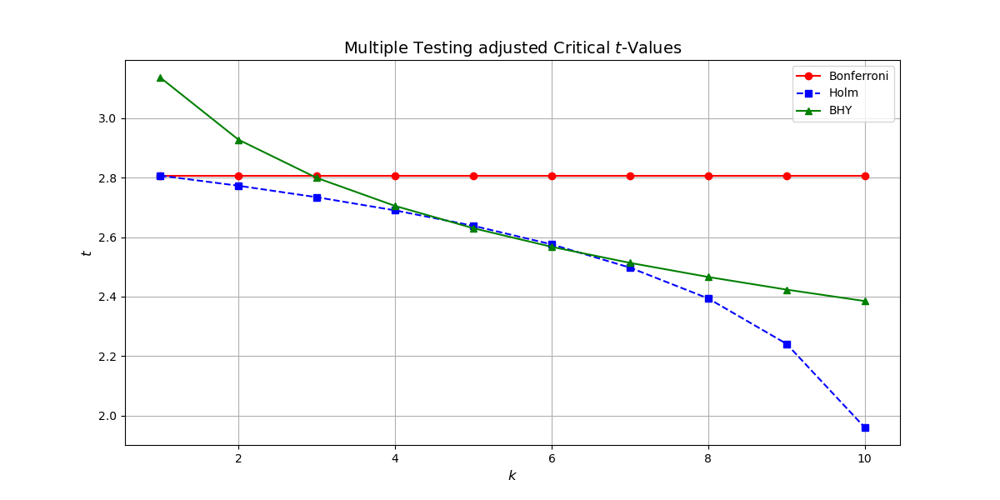

# Investment Strategy Evaluation

  

  <i>Adjusted significance levels for $m=10$ and $\alpha=.05$</i>

This repository contains functions for evaluating investment strategies considering multiple testing.

## Sharpe Ratio and $t$-Statistic

### Sharpe Ratio

The Sharpe Ratio measures the average return that exceeds the risk-free rate, relative to the volatility of the return. It is a commonly used metric to understand the risk-adjusted return of an investment.

$$
SR = \frac{\mu - r_f}{\sigma}
$$

- $\mu$: Mean return
- $r_f$: Risk-free rate
- $\sigma$: Standard deviation of the return

### $t$-Statistic

The $t$-Statistic here refers to the average excess return and can be be simply computed as follows:

$$
t = \frac{\mu - r_f}{\sigma} \times \sqrt{N} = SR \times \sqrt{N}
$$

- $N$: Number of returns

## Multiple Testing Adjustments

### Bonferroni Method

The Bonferroni Method is a conservative approach for multiple testing correction. It reduces the chance of type I errors (false positives) by dividing the significance level by the number of tests.

$$
p = \frac{\alpha}{m}
$$

- $\alpha$: Significance level
- $m$: Number of tests

### Holm Method

The Holm Method is a stepwise correction that is less conservative than the Bonferroni Method. It adjusts the $p$-values sequentially, starting from the smallest, and ensures that the significance level is maintained across multiple tests.

$$
p_{k} = \frac{\alpha}{m + 1 - k}
$$

- $k$: Index of the test sorted by ascending $p$-value

### Benjamini-Hochberg-Yekutieli Method

The BHY Method controls the False Discovery Rate (FDR) and is less conservative than Family-wise Error Rate (FWER) methods like Bonferroni and Holm. FDR is the expected proportion of false discoveries among the rejected hypotheses.

$$
p_{k} = \frac{k \times \alpha}{m \times \left(\frac{1}{1} + \frac{1}{2} + \ldots + \frac{1}{m}\right)}
$$

## Adjusting the Sharpe Ratio (Haircut)

The Sharpe Ratio is adjusted (haircut) by plugging the adjusted test statistic into the equation to compute the $t$-statistic.
